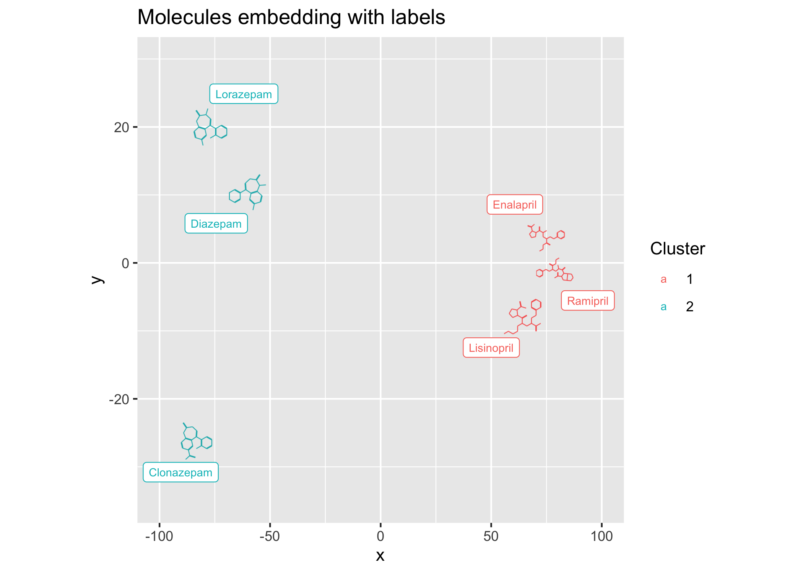
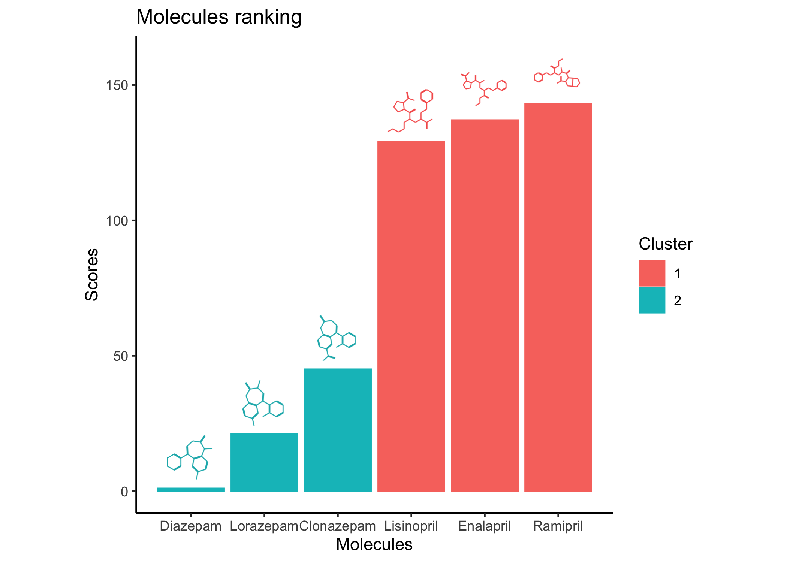
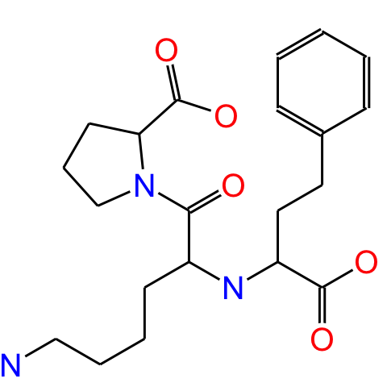

<style> table img { background-color: transparent; } </style>

# ggmol

ggmol is an R package designed for creating publication ready
visualizations based on small molecules within the ggplot2 framework.
The packages is built over ChemmineR and allows to simplify
visualization by only relying on the molecules SMILES strings.

In the following code, the necessary libraries are loaded and the
environment is set up for generating molecular visualizations.

A set of example molecules is defined using their SMILES representations
and a `Chemmol` object is created, which is a container for handling
chemical data in the ggmol package.

``` r
example_set <- c(
Diazepam = "CN1c2ccc(Cl)cc2C(=NCC1=O)c1ccccc1",
Lorazepam = "OC1N=C(c2ccccc2Cl)c2cc(Cl)ccc2NC1=O",
Clonazepam = "[O-][N+](=O)c1ccc2NC(=O)CN=C(c3ccccc3Cl)c2c1",
Lisinopril = "NCCCC[C@H](N[C@@H](CCc1ccccc1)C(O)=O)C(=O)N1CCC[C@H]1C(O)=O",
Enalapril = "CCOC(=O)[C@H](CCc1ccccc1)N[C@@H](C)C(=O)N1CCC[C@H]1C(O)=O",
Ramipril = "CCOC(=O)[C@H](CCc1ccccc1)N[C@@H](C)C(=O)N1[C@H]2CCC[C@H]2C[C@H]1C(O)=O"
)

chemms <- Chemmol(smiles=new("SMIset", smilist=as.list(example_set)))
```

## Drawing structures

``` r
ggplot(mapping=aes(0, 0, smiles=example_set[4], chemsize=2/3)) +
  geom_mol(show_atoms=T)+
  theme(aspect.ratio=1)+
  labs(title=names(example_set)[4], x=NULL, y=NULL)
```


In the following code, molecular glyphs are generated and plotted for
each molecule in the example set. The `geom_mol()` function is used to
render these glyphs within ggplot2, and `facet_wrap` arranges them to
display each molecule separately.

``` r
tab <- data.frame(
  name = names(example_set),
  smiles = example_set
)

ggplot(tab, aes(0, 0, smiles=smiles, label=name, chemsize=2/3)) +
  geom_mol()+
  theme_no_axes()+
  facet_wrap(~name)+
  theme(aspect.ratio=1)+
  labs(title="Faceted molecules")
```


## 2D embedding based on structural distance

A distance matrix for the molecules is computed using the ggmol `dist`
function, and the Sammon mapping algorithm is used to generate a 2D
embedding based on their structural similarities. K-means clustering is
applied to group the molecules into clusters.

``` r
moldists <- dist(chemms)
```

    ## [1] "running dist"

``` r
fprints_2d <- sammon(moldists)$points
```

    ## Initial stress        : 0.00350
    ## stress after  10 iters: 0.00057, magic = 0.020
    ## stress after  20 iters: 0.00026, magic = 0.500
    ## stress after  30 iters: 0.00020, magic = 0.500

``` r
clusters <- kmeans(fprints_2d, 2)$cluster

tab <- data.frame(
  x = fprints_2d[,1],
  y = fprints_2d[,2],
  name = names(example_set),
  smiles = example_set,
  Cluster= as.factor(clusters)
)
```

The following code shows a 2D embedding of the molecules, with each
point representing a molecule and colored by its cluster. The
`geom_mark_ellipse` function adds ellipses around clusters to highlight
them.

``` r
ggplot(tab, aes(x, y, smiles=smiles, colour=Cluster, chemsize=.1)) +
  geom_mol(show_atoms=F, resolution=700)+
  theme_bw()+
  labs(title="Molecules embedding with clusters")+
  lims(x=c(-100, 100), y=c(-35, 35))+
  geom_mark_ellipse(aes(colour=Cluster, smiles=NULL), expand = .07)+
  theme(aspect.ratio=1)
```

    ## Warning: Using the `size` aesthetic in this geom was deprecated in ggplot2 3.4.0.
    ## ℹ Please use `linewidth` in the `default_aes` field and elsewhere instead.
    ## This warning is displayed once every 8 hours.
    ## Call `lifecycle::last_lifecycle_warnings()` to see where this warning was
    ## generated.


In the following code, labels are added to the molecules in the 2D
embedding, making it easier to identify them. The `geom_label_repel`
function helps to avoid overlapping labels.

``` r
library(ggrepel)
ggplot(tab, aes(x, y, smiles=smiles, colour=Cluster, label=name, chemsize=.08)) +
  geom_mol(resolution=700, show_atoms=F)+
  labs(title="Molecules embedding with labels")+
  geom_label_repel(size=2.5, point.padding=17)+
  lims(x=c(-100, 100), y=c(-35, 30))+
  theme(aspect.ratio=1)
```



## Ranking molecules

The following code demonstrates how to rank molecules based on their
distance scores. The bar plot shows the scores for each molecule, with
the molecular glyphs displayed above the bars.

``` r
scores <- as.matrix(moldists)[1,]

ggplot(tab[order(scores),], aes(x=1:nrow(tab), y=sort(scores)+1, smiles=smiles,
                label=name, chemsize=.1, fill=Cluster, colour = Cluster)) +
  geom_bar(stat="identity")+
  geom_mol(y=sort(scores)+13, show_atoms=F, resolution=700) +
  theme_classic()+
  labs(title="Molecules ranking", y="Scores", x="Molecules")+
  ylim(0, 160)+
  theme(aspect.ratio=1)+
  scale_x_continuous(breaks=1:nrow(tab), labels=tab$name)
```



## Table

In the following code, molecules are displayed side by side with their
respective scores annotated. The `facet_wrap` function is used to
arrange each molecule in a separate panel.

``` r
# Create a data frame with molecule names and their corresponding SMILES strings
tab <- data.frame(
  name = names(example_set),
  smiles = example_set,
  row.names = NULL
)

# Generate molecular glyphs and store file paths
image_files <- generate_chem_glyphs(tab$smiles)
moved_files <- file.path("example_images", paste0(1:length(image_files), ".png"))
for(i in 1:length(image_files))
  file.rename(image_files[i], moved_files[i])

# Convert the image file paths to Markdown image links
#tab$image <- sprintf("", tab$name, image_files)
tab$image <- sprintf('', moved_files, tab$name)


# Create a Markdown table
knitr::kable(tab, format = "markdown", col.names = c("Name", "SMILES", "Structure"))
```

| Name       | SMILES                                                                             | Structure                                                      |
|:-----------|:-----------------------------------------------------------------------------------|:---------------------------------------------------------------|
| Diazepam   | CN1c2ccc(Cl)cc2C(=NCC1=O)c1ccccc1                                                  |    |
| Lorazepam  | OC1N=C(c2ccccc2Cl)c2cc(Cl)ccc2NC1=O                                                |   |
| Clonazepam | \[O-\]\[N+\](=O)c1ccc2NC(=O)CN=C(c3ccccc3Cl)c2c1                                   |  |
| Lisinopril | NCCCC[C@H](N%5BC@@H%5D(CCc1ccccc1)C(O)=O)C(=O)N1CCC\[<C@H>\]1C(O)=O                |  |
| Enalapril  | CCOC(=O)[C@H](CCc1ccccc1)N[C@@H](C)C(=O)N1CCC\[<C@H>\]1C(O)=O                      |   |
| Ramipril   | CCOC(=O)[C@H](CCc1ccccc1)N[C@@H](C)C(=O)N1\[<C@H>\]2CCC\[<C@H>\]2C\[<C@H>\]1C(O)=O |    |
