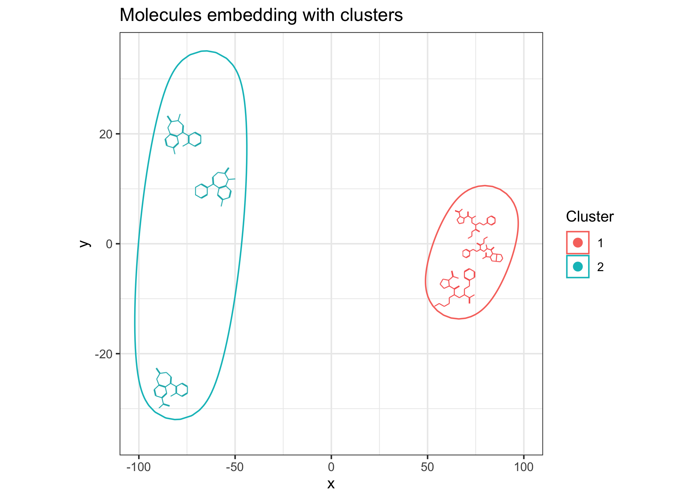

# ggmol

``` r
example_set <- c(
Diazepam = "Diazepam",
Lorazepam = "Lorazepam",
Clonazepam = "Clonazepam",
Lisinopril = "Lisinopril",
Enalapril = "Enalapril",
Ramipril = "Ramipril"
#Quinapril = "Quinapril"
#Benazepril = "Benazepril"
)

x <- read.csv("/Users/francesco/datapool/git/BAT-drugs/data/in/GSE70138_Broad_LINCS_pert_info.txt", sep="\t")
w <- which(tolower(x$pert_iname) %in% tolower(names(example_set)))
example_set <- x[w, "canonical_smiles"]
#example_set <- gsub("\\\\|/", "", x[w, "canonical_smiles"])
names(example_set) <- x[w, "pert_iname"]
dups <- which(duplicated(names(example_set)))
if (any(dups)) example_set <- example_set[-dups]
chemms <- Chemmol(smiles=new("SMIset", smilist=as.list(example_set)))
```

``` r
tab <- data.frame(
  name = names(example_set),
  smiles = example_set
)

a <- generate_chem_glyphs(tab$smiles, atomcex=2)


ggplot(tab, aes(0, 0, image_files=a, smiles=smiles, label=name, chemsize=2/3)) +
  geom_mol()+
  theme_no_axes()+
  facet_wrap(~name)+
  theme(aspect.ratio=1)
```

<!-- -->

``` r
moldists <- dist(chemms)
```

    ## [1] "running dist"

``` r
fprints_2d <- sammon(moldists)$points
```

    ## Initial stress        : 0.00350
    ## stress after  10 iters: 0.00057, magic = 0.020
    ## stress after  20 iters: 0.00026, magic = 0.500
    ## stress after  30 iters: 0.00020, magic = 0.500

``` r
clusters <- kmeans(fprints_2d, 2)$cluster

tab <- data.frame(
  x = fprints_2d[,1],
  y = fprints_2d[,2],
  name = names(example_set),
  smiles = example_set,
  Cluster= as.factor(clusters)
)
```

## 2D embedding based on structural distance

``` r
ggplot(tab, aes(x, y, smiles=smiles, chemsize=.06)) +
  geom_mol(show_atoms=F)+
  theme_bw()+
  labs(title="ChemMap example")+
  lims(x=c(-100, 100), y=c(-35, 30))+
  geom_mark_ellipse(aes(colour=Cluster, smiles=NULL), expand = .07)+
  theme(aspect.ratio=1)
```

    ## Warning: Using the `size` aesthetic in this geom was deprecated in ggplot2 3.4.0.
    ## ℹ Please use `linewidth` in the `default_aes` field and elsewhere instead.
    ## This warning is displayed once every 8 hours.
    ## Call `lifecycle::last_lifecycle_warnings()` to see where this warning was
    ## generated.

<!-- -->

``` r
library(ggrepel)
ggplot(tab, aes(x, y, smiles=smiles, colour=Cluster, label=name, chemsize=.08)) +
  geom_mol(resolution=150, show_atoms=F)+
  labs(title="ChemMap example")+
  geom_label_repel( size=2.5, point.padding=17)+
  lims(x=c(-100, 100), y=c(-35, 30))+
  theme(aspect.ratio=1)
```

<!-- --> \## Ranking
molecules

``` r
scores <- as.matrix(moldists)[1,]

ggplot(tab[order(scores),], aes(x=1:nrow(tab), y=sort(scores)+1, smiles=smiles,
                label=name, chemsize=.1, fill=Cluster)) +
  geom_bar(stat="identity")+
  geom_mol(y=sort(scores)+13, show_atoms=F) +
  theme_classic()+
  labs(title="ChemMap example", y="Scores", x="Molecules")+
  ylim(0, 180)+
  theme(aspect.ratio=1)+
  scale_x_continuous(breaks=1:nrow(tab), labels=tab$name)
```

<!-- -->

``` r
  #coord_flip()
```

## Molecules side by side

``` r
library(ggpmisc)
```

    ## Warning: package 'ggpmisc' was built under R version 4.2.3

    ## Loading required package: ggpp

    ## Warning: package 'ggpp' was built under R version 4.2.3

    ## Registered S3 methods overwritten by 'ggpp':
    ##   method                  from   
    ##   heightDetails.titleGrob ggplot2
    ##   widthDetails.titleGrob  ggplot2

    ## 
    ## Attaching package: 'ggpp'

    ## The following object is masked from 'package:ggplot2':
    ## 
    ##     annotate

    ## Registered S3 method overwritten by 'ggpmisc':
    ##   method                  from   
    ##   as.character.polynomial polynom

``` r
ggplot(tab, aes(0, 0, smiles=smiles, colour=Cluster, label=name, chemsize=.9, resolution=300)) +
  geom_mol()+
  theme_no_axes()+
  geom_text(label=paste("Score:", round(scores, 3)),
            x=Inf, y=-Inf, vjust=-.5, hjust=1.1,
            size=2.5, colour="black")+
  facet_wrap(~name)+
  theme(aspect.ratio=1)
```

<!-- -->
